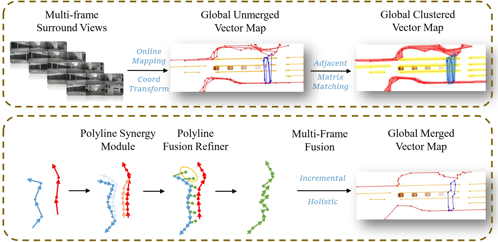

## Introduction
<div align="center"><h4>GMP is a Global Vectorized HD Map Construction System using Visual Local Map Networks </h4></div>




High-definition (HD) maps are essential for autonomous driving, providing precise road geometry. Traditional HD map creation is costly and time-consuming. This paper introduces a novel vision-based framework for constructing global vectorized HD maps. It integrates regular design with deep learning outputs to achieve polyline refinement and fusion. Our approach addresses challenges like redundant element merging and incomplete shape recovery, demonstrating superior performance across diverse driving scenarios. We propose an efficient dataset construction method and benchmark our approach using comprehensive metrics. Our work advances scalable and accurate map generation for autonomous driving.

## Dataset

We use MapTRv2 to inference on nuScenes, Argoverse2 and our custom UPARK datasets. We organized the data into pickle form to test global stitching methods easily. The pickle data includes local predictions, location, local and global map ground truth.

| dataset | download|
| :---: | :---: | 
| nuScenes | [nuScenes](data/result_keep_all_nuscenes_glb.pkl)|
| Argoverse2 | [Argoverse2](data/result_keep_all_argo_glb.pkl)|
| UPARK | [UPARK](data/result_keep_all_weijing_glb.pkl) |

## Performance

We evaluate the performance of our approach on nuScenes, Argoverse2 and UPARK datasets. We use the F1 Score metrics to measure the global map construction accuracy. We use Chamfer and Frechet distance separately to caculate F1 Score.


<div align="center"><h4> UPARK dataset</h4></div>

| Methods          | Chamfer Divider | Chamfer Boundary | Chamfer Mean | Frechet Divider | Frechet Boundary | Frechet Mean |
|------------------|-----------------|------------------|--------------|-----------------|------------------|--------------|
| PolyMerge        | 0.6667          | 0.4762           | 0.5715       | 0.2989          | 0.0000           | 0.1945       |
| MapTracker       | 0.3825          | 0.1616           | 0.2721       | 0.3934          | 0.1414           | 0.2674       |
| GlobalMapNet     | 0.4339          | 0.1159           | 0.2749       | 0.3810          | 0.1217           | 0.2514       |
| Ours (Incre)     | 0.6889          | 0.5806           | 0.6348       | 0.5778          | 0.2581           | 0.4180       |
| Ours (Holistic)  | 0.7556          | 0.6173           | 0.6865       | 0.4000          | 0.4444           | 0.4222       |


<div align="center"><h4> nuScenes dataset</h4></div>

| Methods          | Chamfer Divider | Chamfer Ped| Chamfer Boundary | Chamfer Mean | Frechet Divider | Frechet Ped| Frechet Boundary | Frechet Mean |
|------------------|-----------------|----------------------|------------------|--------------|-----------------|----------------------|------------------|--------------|
| PolyMerge        | 0.6381          | 0.5399               | 0.4792           | 0.5524       | 0.3935          | 0.3935               | 0.2064           | 0.3311       |
| MapTracker       | 0.6051          | 0.3557               | 0.4750           | 0.4786       | 0.4279          | 0.4403               | 0.3290           | 0.3991       |
| GlobalMapNet     | 0.4159          | 0.2521               | 0.3180           | 0.3407       | 0.3030          | 0.1945               | 0.2380           | 0.2452       |
| Ours (Incre)     | 0.6762          | 0.6591               | 0.5292           | 0.6215       | 0.4779          | 0.4520               | 0.3515           | 0.4271       |
| Ours (Holistic)  | 0.6742          | 0.6514               | 0.5188           | 0.6148       | 0.4701          | 0.4419               | 0.3379           | 0.4166       |


<div align="center"><h4> Argoverse2 dataset</h4></div>

| Methods          | Chamfer Divider | Chamfer Ped | Chamfer Boundary | Chamfer Mean | Frechet Divider | Frechet Ped | Frechet Boundary | Frechet Mean |
|------------------|-----------------|----------------------|------------------|--------------|-----------------|----------------------|------------------|--------------|
| PolyMerge        | 0.5192          | 0.1783               | 0.4671           | 0.3882       | 0.2111          | 0.1685               | 0.1176           | 0.1657       |
| MapTracker       | 0.3316          | 0.2815               | 0.2869           | 0.3000       | 0.2627          | 0.1844               | 0.1919           | 0.2130       |
| GlobalMapNet     | 0.2134          | 0.2912               | 0.1499           | 0.2182       | 0.1467          | 0.2383               | 0.0954           | 0.1601       |
| Ours (Incre)     | 0.4704          | 0.2612               | 0.4579           | 0.3965       | 0.3162          | 0.2521               | 0.2948           | 0.2877       |
| Ours (Holistic)  | 0.4888          | 0.2392               | 0.4814           | 0.4031       | 0.3311          | 0.2303               | 0.3150           | 0.2921       |


## Getting Started
- Using code below to  test all methods
```python
python -m evaluate.eval_all_methods
```

## Acknowledgements

GMP is greatly inspired by the following outstanding contributions to the open-source community: [MapTR](https://github.com/hustvl/MapTR/), [PolyMerge](https://github.com/mohamed-mkh15/PolyMerge), [MapTracker](https://github.com/woodfrog/maptracker), [GlobalMapNet](https://github.com/woodfrog/maptracker).